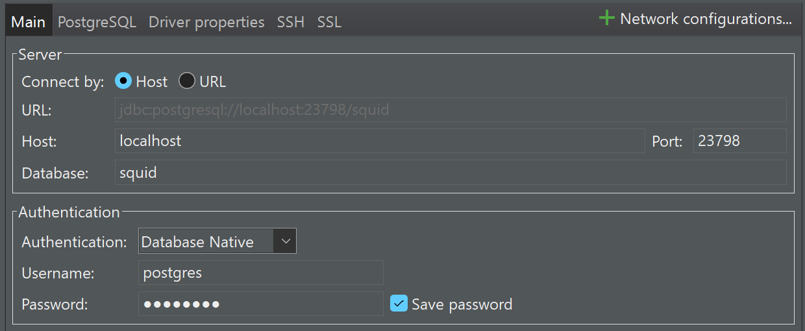

# reNFT v3 Indexing - Subsquid

## Development

To spin up a docker db:

`sqd up`

If you need to generate a new migrations script, first, check the format of the migrations file in (db/migrations). Notice how it's formatted. After making changes to `schema.graphql`, run:

`sqd migrations:generate`

Now, go to the generated migrations file, and re-format it to match the format of other migration files.

Note, that by default, it will generate indices for all the columns on the table. This isn't necessary. Choose the columns you want to index and remove the rest. Moreover, it will autogenerate removals of indices in the `down` step. This isn't required if you drop the database, so remove those too.

---

Right now it's quite hacky to run the migrations when you are using external db.

We have switched off squid from running migrations itself (you cannot set `DB_NAME`, `DB_USER`, etc. when deploying to squid's cloud). Therefore, it is your responsibility, to manually run migrations before you deploy. To do so, set correctly (**notice there is no `V3_` prefix!**):

- `DB_HOST`
- `DB_NAME`
- `DB_USER`
- `DB_PASS`

in `.env` and then run `sqd migration:apply`

---

You can learn about all the commands at your disposal in `commands.json`

To connect to the database and explore the data you can use various clients, for example:

- pgAdmin (if you will just use it for PostgreSQL)
- DBeaver (if you will use it for multiple databases)
- DBVisualiser (if you will use it for multiple databases)

Here is the default data you'd need to use to connect to the db:



Port in the above depends on what you set in `.env` file.

Password is `postgres`

---

To start sepolia indexing run:

`sqd process:eth-sepolia`

To start mumbai indexing run:

`sqd process:polygon-mumbai`

---

To have subsquid write to your own database locally, utilise the following environment variables:

- `V3_DB_HOST`
- `V3_DB_PORT`
- `V3_DB_NAME`
- `V3_DB_USER`
- `PGSSLMODE=true` (you only need this if you are writing to externally hosted db from local terminal)

To have hosted squid service pick up our external db, we need to re-define `DB_HOST`, `DB_PORT`, `DB_NAME` and `DB_USER` to point to the above. That is what you see before processors gets initialised in this codebase.

## Good To Know

To deploy, re-deploy squid, just run

```bash
sqd deploy .
```

make sure your `sqd` is `@ 2.7.0`

## Gotchas

You can corrupt your processor's state by setting finality too low.

We had polygon mainnet processor corrupt the state with finality 20 and re-org: 17 blocks.

If your subsquid indexed data is not in the same db as your other data, then easiest
solution is to create a new database and re-index. However, if you have indexed
data along with other data, this is not practical. Here is the script that
helps remove processor's data to re-index it:

```sql
-- public schema
-- 1/ remove everything for a given processor in block table
DELETE FROM block WHERE network = 'polygon-mainnet';
-- 2/ remove everything for a given processor in rental_safe_deployment table
DELETE FROM rental_safe_deployment WHERE network = 'polygon-mainnet';
-- 3/ remove everything for a given processor in rental_started table
DELETE FROM rental_started WHERE network = 'polygon-mainnet';
-- 4/ remove everything for a given processor in rental_stopped table
DELETE FROM rental_stopped WHERE network = 'polygon-mainnet';

-- processor's schema
-- 1/ delete everything in hot_block table
DELETE FROM polygon_mainnet_processor.hot_block;
-- 2/ delete everything in hot_change_log table
DELETE FROM polygon_mainnet_processor.hot_change_log;
-- 3/ delete everything in status table
DELETE FROM polygon_mainnet_processor.status;
```

The above will only work in a setting where indexed data is not related to any
other data in the same db. i.e. you are not persisting some other data in the
db that depends on the above data. If so, read the note below.

If you have indexed data sitting alongside other data, which in turn depends on indexed data,
this is squid's recommended approach to resolving the reorg conflicts:

```
But is it possible to do it gradually, in 3 steps:
1) Create new fields/tables releation_v2 or migarate old fields/tables with old_ prefix
2) Re-sync a squid with new fields
3) Delete old fields and data
```

For `finalityConfirmation` values, use this silly script in etherscan's forked blocks
explorer to figure out the max reorg depth the chain has experienced (there is certainly
a better way to do it):

```js
async function findMaxReorgDepth() {
  const totalPages = 2169;
  let maxReorgDepth = 0;

  for (let page = 1; page <= totalPages; page++) {
    const url = `https://etherscan.io/blocks_forked?ps=100&p=${page}`;
    const response = await fetch(url);
    const html = await response.text();

    const parser = new DOMParser();
    const doc = parser.parseFromString(html, "text/html");
    const reorgDepthElements = doc.querySelectorAll(
      ".table tbody tr td:nth-child(11)",
    );

    reorgDepthElements.forEach((element) => {
      const reorgDepth = parseInt(element.textContent, 10);
      if (reorgDepth > maxReorgDepth) {
        maxReorgDepth = reorgDepth;
      }
    });

    console.log(`page: ${page}, max reorg depth: ${maxReorgDepth}`);

    // Delay before moving to the next page
    await new Promise((resolve) => setTimeout(resolve, 100));
  }
}
```

Finally, there is no downside other than extra db space to set high finality.
For polygon mainnet, for example, subsquid team is using 200 blocks. Set
very high finality and be happy.

## Prod

### Architecture

Production chains are written to prod db.

Testnet chains are written to dev db.

We have separate manifests for the above: `squid.prod.yaml` and `squid.dev.yaml` respectively.

The reason we do not have a single manifest is because we want dev squid writing to a separate db.

As of the time of writing: April 9th 2024, this was not achievable in a single manifest file.

To deploy prod squid to the cloud:

```bash
sqd deploy . -m "squid.prod.yaml" --org zero-to-one
```

To deploy dev squid to the cloud:

```bash
sqd deploy . -m "squid.dev.yaml" --org zero-to-one
```

### Nice to have

Writing data to non-"public" schema would be useful, that way we do not run risk of having api read or write from the wrong schema.

What schema to write to depends on the user. So creating a user with requisite settings, will ensure you are writing to the right schema. However, if you are using a hosted db that doesn't allow you to tinker with those settings, then there is no way to write to a schema other than "public". This is one of the drawbacks of having squid write to your own db. If you can control what schemas your other services write to, then it's better to adjust settings there and squid will keep writing to "public" schema.
